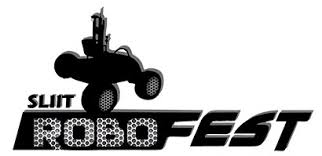
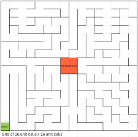
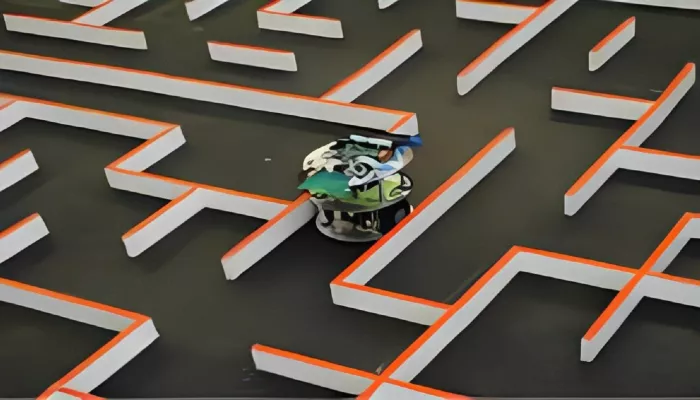
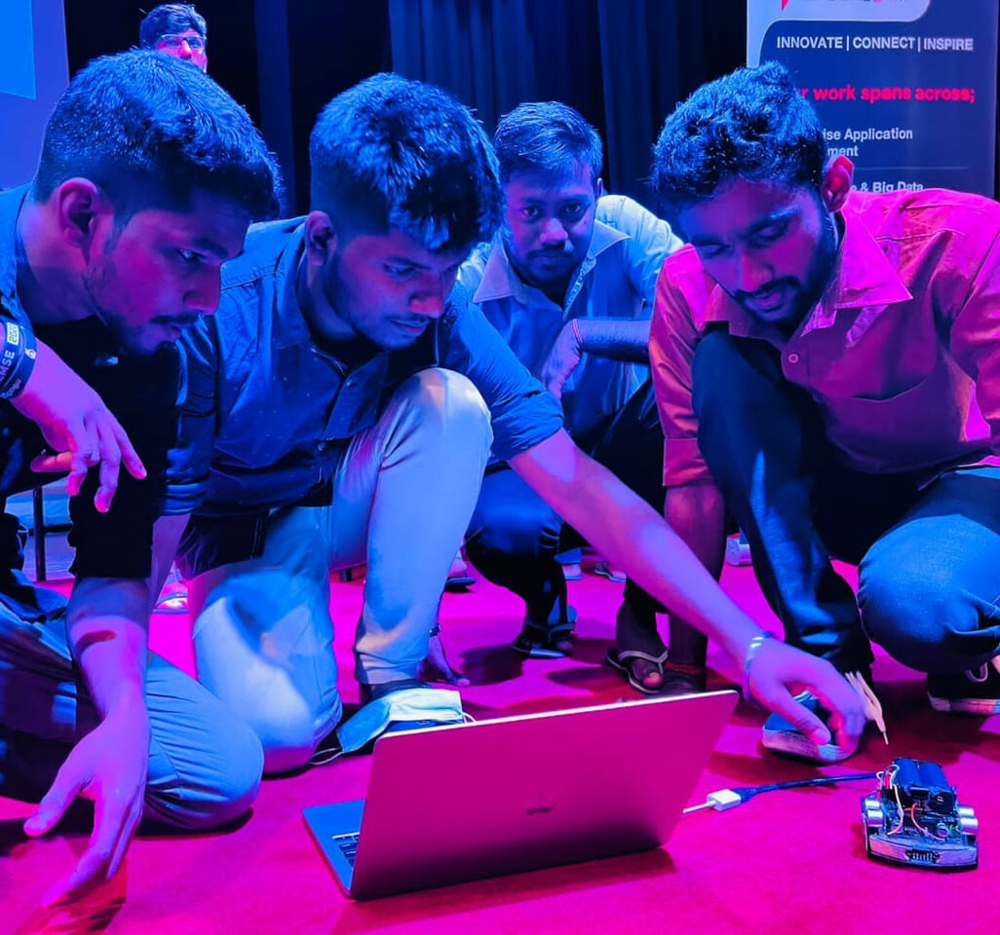

# Maze-Solving Micro Mouse Project



## Overview
This repository contains the code and documentation for the **Maze-Solving Micro Mouse Robot** project developed for a robotics competition in 2022. The robot uses a flood-fill algorithm to navigate a maze autonomously and determine the shortest path to the goal.

> ⚠️ **Important Note**:  
> The flood-fill algorithm logic used in this competition is **not included** in this repository.  
> Only the sensor-related libraries and necessary interface functions are shared here.  
> If you're interested in the full algorithm or implementation details, feel free to contact me via [LinkedIn](www.linkedin.com/in/thanupiriyan-sannithy-197564244) or email.

## Competition Format
The competition was based on the classic **Micro Mouse challenge**, where the task is to navigate a **16×16 cell maze**, with each cell measuring **16 cm × 16 cm**. The objective is for the robot to autonomously find and travel the **shortest path to the center** of the maze in the least possible time.

Each team had to develop their own algorithms, hardware integration, and path-planning logic to efficiently guide their robot from the start position to the goal (center) and back.

### Maze Layout Example:
 
 

## Flood-Fill Algorithm in Action
To solve the maze, we used a **flood-fill algorithm**, which plays a critical role in path planning. Here’s how it works in our robot:

- Initially, all cells in the maze are assigned a value based on their distance from the center (goal).
- The robot scans its surroundings using TOF distance sensors and updates the map with known walls.
- Based on flood-fill values, it chooses the neighboring cell with the **lowest value** and proceeds in that direction.
- As new walls are discovered, the maze is dynamically updated, and the algorithm recalculates the shortest route.
- Once the center is reached, a final optimized path is executed for high-speed traversal.

This allowed our robot to **adapt in real-time** and optimize its movement as it explored.

## Hardware Components Used
The following components were used in the robot's design and build:

- 🔧 **N20 Gear Motors** with Magnetic Encoders (300 RPM)
- 📦 **STM32F103C8T6 "Blue Pill" Microcontroller**
- 🧭 **Gyroscope Sensor**
- 📏 **VL53L0X Time-of-Flight (TOF) Distance Sensors**
- 📏 **Ultrasonic Distance Sensors**
- ⚙️ **2x D-Hole Wheels** (32 mm diameter)
- ⚪ **1x Castor Ball Wheel** (free-rotating for stability)
- 🔊 **Buzzer** (for signaling status or errors)

## Team

 
- **Thanupiriyan S.**  
- **Tharsan I.**  
- **Bharkavasharama K.**
- **Aphiram.A**

## Features
- Flood-fill-based autonomous maze-solving
- Real-time sensor fusion with TOF and gyroscope
- Modular firmware using PlatformIO for STM32
- Compact chassis design with precise motion control

## How to Use
1. Clone the repository:
   ```bash
   git clone https://github.com/Thanupiriyan-Hub/maze-solving-micromouse-2024.git
